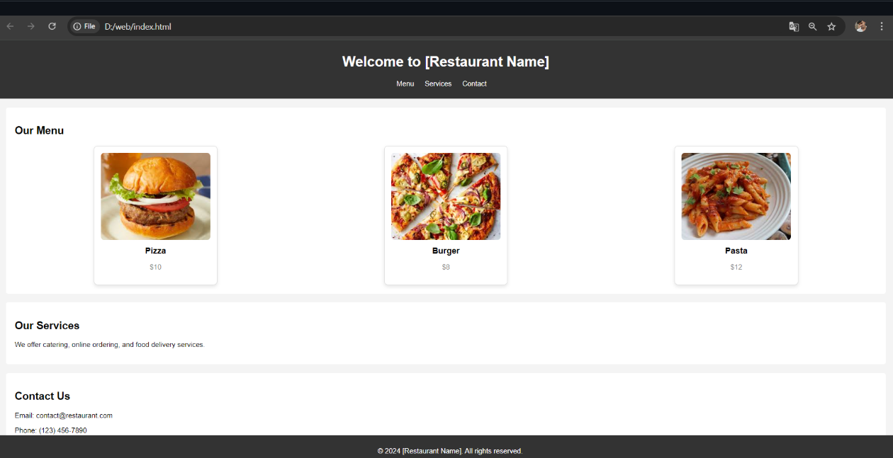

# Ex.07 Restaurant Website
## Date:

## AIM:
To develop a static Restaurant website to display the food items and services provided by them.

## DESIGN STEPS:

### Step 1:
Requirement collection.

### Step 2:
Creating the layout using HTML and CSS.

### Step 3:
Updating the sample content.

### Step 4:
Choose the appropriate style and color scheme.

### Step 5:
Validate the layout in various browsers.

### Step 6:
Validate the HTML code.

### Step 7:
Publish the website in the given URL.

## PROGRAM:
```
index.html
<!DOCTYPE html>
<html lang="en">
<head>
    <meta charset="UTF-8">
    <meta name="viewport" content="width=device-width, initial-scale=1.0">
    <title>Restaurant Website</title>
    <link rel="stylesheet" href="styles.css">
</head>
<body>
    <header>
        <h1>Welcome to [Restaurant Name]</h1>
        <nav>
            <ul>
                <li><a href="#menu">Menu</a></li>
                <li><a href="#services">Services</a></li>
                <li><a href="#contact">Contact</a></li>
            </ul>
        </nav>
    </header>
    
    <section id="menu">
        <h2>Our Menu</h2>
        <div class="menu-row">
            <!-- Card 1 -->
            <div class="card">
                
                <h3>Pizza</h3>
                <p>$10</p>
            </div>
            <!-- Card 2 -->
            <div class="card">
                
                <h3>Burger</h3>
                <p>$8</p>
            </div>
            <!-- Card 3 -->
            <div class="card">
                
                <h3>Pasta</h3>
                <p>$12</p>
            </div>
        </div>
    </section>
    
    <section id="services">
        <h2>Our Services</h2>
        <p>We offer catering, online ordering, and food delivery services.</p>
    </section>
    
    <section id="contact">
        <h2>Contact Us</h2>
        <p>Email: contact@restaurant.com</p>
        <p>Phone: (123) 456-7890</p>
    </section>
    
    <footer>
        <p>&copy; 2024 [Restaurant Name]. All rights reserved.</p>
    </footer>
</body>
</html>
style.css
body {
    font-family: Arial, sans-serif;
    margin: 0;
    padding: 0;
    background-color: #f4f4f4;
}

header {
    background-color: #333;
    color: #fff;
    padding: 10px 0;
    text-align: center;
}

nav ul {
    list-style: none;
    padding: 0;
}

nav ul li {
    display: inline;
    margin-right: 20px;
}

nav ul li a {
    color: #fff;
    text-decoration: none;
}

section {
    padding: 20px;
    margin: 20px;
    background-color: #fff;
    border-radius: 5px;
}

footer {
    text-align: center;
    padding: 10px;
    background-color: #333;
    color: #fff;
    position: fixed;
    width: 100%;
    bottom: 0;
}

/* Menu Row Styling */
.menu-row {
    display: flex;
    flex-wrap: wrap;
    justify-content: space-around;
    gap: 20px;
    margin-top: 20px;
}

/* Card Styling */
.card {
    background-color: #fff;
    border: 1px solid #ddd;
    border-radius: 8px;
    padding: 15px;
    text-align: center;
    width: 250px; /* Fixed width for each card */
    box-shadow: 0 4px 8px rgba(0, 0, 0, 0.1);
    transition: transform 0.2s ease-in-out;
}

.card img {
    width: 100%;
    height: 200px;
    object-fit: cover;
    border-radius: 8px;
}

.card h3 {
    margin: 10px 0;
    font-size: 1.2em;
}

.card p {
    color: #888;
    font-size: 1em;
}

/* Add hover effect to cards */
.card:hover {
    transform: scale(1.05);
}
```

## OUTPUT:


## RESULT:
The program for designing software company website using HTML and CSS is completed successfully.
